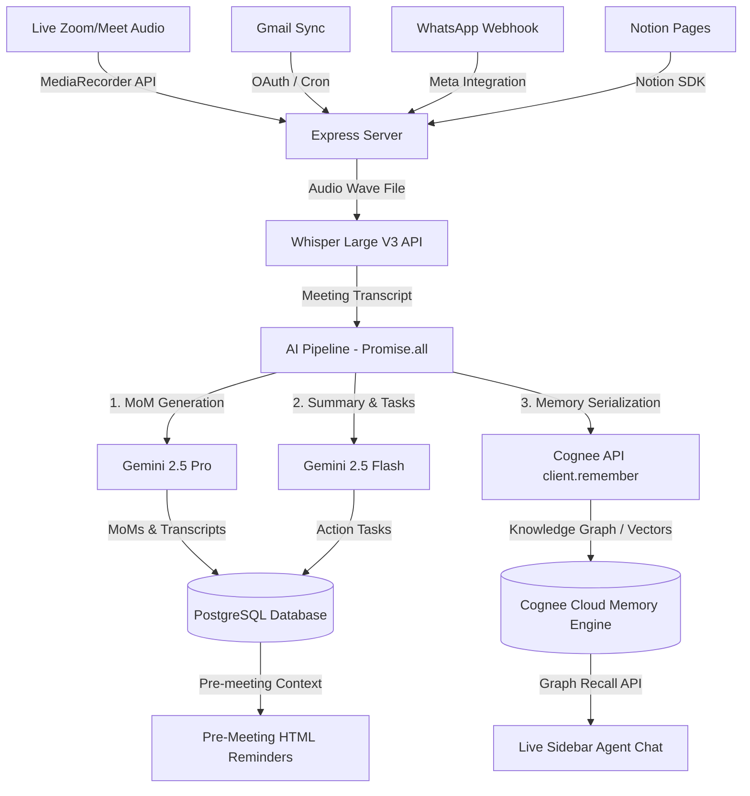

#  OmniMind AI: Enterprise Memory Intelligence & Meeting Copilot

> Built for the **"The Hangover Part AI"** Hackathon  — Powered by **Cognee Cloud**.

OmniMind AI is an enterprise-grade client intelligence system and meeting copilot designed to eliminate organizational memory loss. By combining emails, documents, Slack chats, WhatsApp messages, and live meeting transcripts into a **hybrid Knowledge Graph and Vector Memory** powered by **Cognee Cloud**, OmniMind ensures that your AI agents and account executives never suffer from amnesia.

---

##  Live Repository
* **GitHub Repository:** [github.com/shivamshrma09/ominiMinds](https://github.com/shivamshrma09/ominiMinds)

---

##  The Hangover: "Doug is missing, where's my context?"
Stateless LLMs wake up every morning with no memory of last night's session. They exceed their context windows, forget client commitments, lose track of pricing revisions, and hallucinate details.

**OmniMind AI solves this by executing the Core Memory Lifecycle with Cognee:**
1. `remember()`: Ingests raw transcripts, Notion docs, emails, and WhatsApp business webhooks into a structured knowledge graph namespace-isolated by client.
2. `recall()`: Answers live meeting queries and agent chat prompts using Cognee's hybrid semantic search and relational graph traversals.
3. `improve()`: Automatically runs post-meeting graph enrichment and client health updates using Gemini.
4. `forget()`: Supports secure data purging to comply with enterprise GDPR guidelines.

---

##  System Architecture & Data Flow



---

##  Key Modules & Features

###  1. Live Meeting Copilot
* **Audio Capture:** One-click recording saves ambient audio directly to the server.
* **Stealth Sidebar Chat:** Account managers can privately query client history ("*What budget was approved in March?*") mid-meeting. The system queries Cognee to pull context across infinite past sessions.

###  2. Post-Meeting Automation Panel
* **Parallel Processing:** On meeting end, launches parallel Gemini API requests to extract action items, summaries, and detailed Minutes of Meetings (MoM).
* **Auto Task Delegation:** Action items are parsed and auto-populated into a structured priority task board (`tasks` SQL table).
* **Graph Ingestion:** The final meeting context is serialized and stored in Cognee Cloud under the client's isolated namespace.

###  3. Passive Background Sync & Deduplication
* **Staggered Sync Scheduler:** Runs every 2 hours via staggered Cron jobs to poll Gmail, WhatsApp, and Slack without hitting Gemini rate limits.
* **SHA-256 Deduplication:** Computes hashes for all synced emails and chats to prevent redundant indexing inside Cognee's memory nodes.

###  4. Pre-Meeting Intelligence & Health Score
* **Pre-Meeting Reminders:** Hourly scheduler generates and emails preparatory briefs containing previous MoMs, open action items, and AI-predicted discussion points.
* **Dynamic Health score:** Computes client health indicators (0-100%) and alerts based on inactivity days, task load, and communication sentiment.

---

##  Tech Stack
* **Frontend:** React.js, TypeScript, Tailwind CSS, Lucide Icons, Custom Glassmorphic layouts.
* **Backend:** Node.js, Express, TypeScript, Node-cron, Axios, Pino.
* **Database:** PostgreSQL (Neon Postgres).
* **Memory & Vector Layer:** Cognee Cloud SDK, Qdrant Cloud.
* **LLM Engine:** Gemini 2.5 Flash & Pro via Google Generative AI SDK.
* **Notification System:** SendGrid Mail API.

---

##  Local Development Setup

### 1. Prerequisites
* Node.js v18+
* PostgreSQL database

### 2. Backend Installation
1. Navigate to the backend folder:
   ```bash
   cd backend
   ```
2. Install dependencies:
   ```bash
   npm install
   ```
3. Create a `.env` file based on `.env.example` and add your keys:
   ```env
   PORT=5000
   DATABASE_URL=your_postgresql_connection_string
   JWT_SECRET=your_secret_key
   GEMINI_API_KEY=your_gemini_api_key
   COGNEE_API_KEY=your_cognee_cloud_api_key
   COGNEE_TENANT_ID=your_cognee_tenant_id
   SENDGRID_API_KEY=your_sendgrid_key
   ```
4. Run database setup & start the development server:
   ```bash
   npm run dev
   ```

### 3. Frontend Installation
1. Navigate to the frontend folder:
   ```bash
   cd ../frontend
   ```
2. Install dependencies:
   ```bash
   npm install
   ```
3. Create a `.env` file:
   ```env
   VITE_API_URL=http://localhost:5000/api
   ```
4. Start the Vite server:
   ```bash
   npm run dev
   ```
5. Open your browser to `http://localhost:5173`.
>>>>>>> f4d4311 (Initial commit for hackathon submission)
